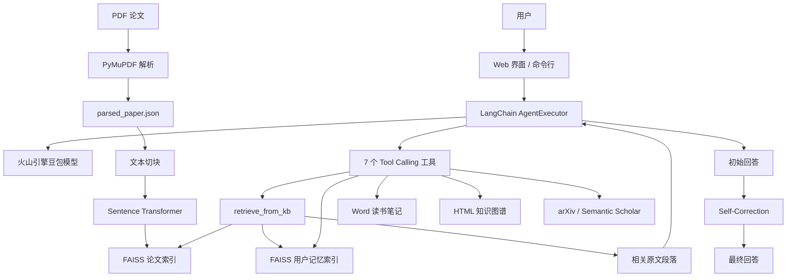

# PaperMind

> **文档来源声明**
>
> 本 README 的内容基础与叙事框架来自项目作者本人完成的两页手写 AI 项目总结《PaperMind：面向本科生的智能科研论文理解 Agent》。项目背景、目标、总体架构、工具集、Self-Correction、双索引长期记忆、交互设计和改进方向均沿用这份手写报告的学习脉络；安装、配置、部署方法和技术边界则结合本地最新版本源代码逐项核对并补充。手写报告图片仅作为整理依据，不包含在公开仓库中。

PaperMind 是一个面向本科生与科研入门用户的本地论文理解 Agent。它将 PDF 解析、RAG 检索、LangChain Tool Calling、回答回源检查、长期记忆、论文搜索和文档生成整合为一套完整工作流，帮助用户更快完成论文阅读、内容问答、笔记整理和知识关联。

项目同时提供 Gradio Web 界面和命令行界面，默认定位为个人本地使用的学习型 AI 应用。

> 项目当前适合个人学习、课程展示和作品集演示。Web 端仍是单用户全局状态设计，不建议未经认证和数据隔离就直接作为公开多人服务。

## 项目目标

传统论文阅读常见三个问题：

1. 专业术语和公式密集，进入论文语境的成本较高。
2. 很难快速判断哪些段落真正回答了当前问题。
3. 阅读结果容易碎片化，缺少持续积累的个人知识库。

PaperMind 围绕这些问题实现了三类能力：

- **降低理解门槛**：从论文原文检索相关段落，让回答尽量建立在论文证据上。
- **提高阅读效率**：通过 Agent 调用解析、检索、搜索、笔记和知识图谱工具。
- **积累长期知识**：将当前论文索引与用户长期记忆分离，支持跨论文保留重要内容。

## 核心能力

| 能力 | 当前实现 |
|---|---|
| PDF 解析 | 使用 PyMuPDF 提取文本，并按照常见中英文章节标题组织内容 |
| RAG 检索 | Sentence Transformers 生成向量，FAISS 执行本地相似度检索 |
| 论文问答 | 火山引擎豆包模型通过 OpenAI 兼容接口接入 LangChain Agent |
| 工具调用 | Agent 根据用户问题选择 7 个论文处理工具 |
| 回源检查 | 对数字、比较和论文结论类声明执行启发式检索与重新生成 |
| 双索引记忆 | 当前论文索引可随换论文清空，用户记忆跨论文持久保留 |
| 延伸阅读 | 优先查询 arXiv，失败时尝试 Semantic Scholar |
| 文件生成 | 输出 Word 读书笔记和可交互 HTML 知识图谱 |
| 双入口 | 提供 Gradio Web 界面与命令行交互入口 |

## 系统架构



系统整体可以理解为三层：

1. **感知层**：解析 PDF、读取用户输入、加载本地索引。
2. **规划与执行层**：LangChain Agent 判断是否需要调用检索、搜索或生成工具。
3. **输出层**：返回回答，并按需生成 Word、HTML 或长期记忆数据。

## 核心工作流程

### 1. PDF 进入 RAG 知识库

```text
PDF 上传
   ↓
PyMuPDF 提取页面文本
   ↓
识别摘要、方法、实验、结论等章节
   ↓
保存为 memory/parsed_paper.json
   ↓
按 CHUNK_SIZE 和 CHUNK_OVERLAP 切块
   ↓
Sentence Transformer 生成向量
   ↓
写入 FAISS 论文索引
```

默认使用 `sentence-transformers/all-MiniLM-L6-v2`。首次运行需要从 Hugging Face 下载模型；模型缓存完成后可重复离线加载。

### 2. Agent 工具调用

PaperMind 使用 `create_openai_tools_agent` 构建 Agent，并通过 `AgentExecutor` 调度工具。系统提示词要求论文内容问题优先调用 `retrieve_from_kb`，然后基于检索段落组织回答。

终端中的 `verbose` 日志可以观察工具名称、输入和执行过程。这属于 **Agent 工具调用轨迹**，不等同于直接公开模型内部隐藏的 Chain-of-Thought。

### 3. 双索引长期记忆

PaperMind 将论文内容和用户记忆分开保存：

| 索引 | 文件 | 生命周期 | 用途 |
|---|---|---|---|
| 当前论文索引 | `paper.index`、`paper_chunks.json` | 换论文时清空 | 检索当前论文原文 |
| 用户记忆索引 | `user_memory.index`、`user_memory_chunks.json` | 跨论文保留 | 保存用户明确要求记住的内容 |

`retrieve_from_kb` 会同时检索两个索引，按相似度合并结果。这样既能避免旧论文干扰当前论文，也能保留用户长期积累的知识。

### 4. Self-Correction 回源检查

当前 Self-Correction 包含三步：

1. **触发检测**：检测百分比、倍数、准确率、比较关系和论文结论等事实性表达。
2. **原文回溯**：将声明作为查询，从知识库检索相关段落。
3. **一致性处理**：使用数字匹配等启发式规则判断是否需要基于原文重新生成。

这套机制可以发现一部分明显的数字冲突，但它不是严格的事实证明系统。数字相同不代表语义一致，没有数字的声明也可能被误判。关键数据仍应回到论文原文核实。

## Agent 工具集

当前 Agent 注册了 7 个工具：

| 工具名称 | 文件 | 作用 |
|---|---|---|
| `parse_pdf` | `tools/parse_pdf.py` | 解析 PDF，识别章节并保存结构化文本 |
| `build_kb` | `tools/knowledge_base.py` | 对解析结果切块、编码并建立论文 FAISS 索引 |
| `retrieve_from_kb` | `tools/knowledge_base.py` | 同时检索论文索引和用户长期记忆 |
| `search_arxiv` | `tools/search_arxiv.py` | 搜索相关论文，并提供 Semantic Scholar 回退路径 |
| `generate_notes_doc` | `tools/generate_notes.py` | 将结构化内容生成 Word 读书笔记 |
| `build_knowledge_map` | `tools/knowledge_map.py` | 生成基于 vis.js 的交互式 HTML 知识图谱 |
| `save_to_memory` | `tools/knowledge_base.py` | 将用户指定内容写入长期记忆索引 |

## 技术栈

| 类型 | 技术 | 用途 |
|---|---|---|
| 大语言模型 | 火山引擎豆包 | 论文问答、查询翻译和纠错重写 |
| Agent 框架 | LangChain 0.2 | Prompt、Tool Calling、AgentExecutor 和对话记忆 |
| Embedding | Sentence Transformers | 将文本块和查询编码为向量 |
| 向量检索 | FAISS CPU | 保存和检索论文、用户记忆向量 |
| PDF 解析 | PyMuPDF | 提取 PDF 页面文本 |
| Web 界面 | Gradio 3.50 | 文件上传、快捷提问和聊天交互 |
| Word 生成 | python-docx | 生成格式化读书笔记 |
| 知识图谱 | vis.js | 在 HTML 中渲染交互式节点关系图 |
| 外部论文源 | arXiv、Semantic Scholar | 搜索延伸阅读 |

Web 相关依赖固定为兼容组合。不要只单独升级 Gradio、FastAPI、Starlette 或 Pydantic，升级后应重新执行真实页面验证。

## 项目结构

```text
Papermin-agent/
├── .env.example                 # 环境变量示例，不包含真实凭据
├── .gitignore                   # 排除密钥、缓存、索引和生成文件
├── README.md                    # 项目说明
├── agent.py                     # Agent、Prompt、工具注册和问答入口
├── config.py                    # 环境变量、模型参数和运行目录
├── main.py                      # 命令行入口
├── self_correction.py           # 启发式回源检查与重新生成
├── web_app.py                   # Gradio Web 入口
├── requirements.txt             # 已验证的 Python 依赖组合
├── tools/
│   ├── __init__.py
│   ├── generate_notes.py        # Word 读书笔记
│   ├── knowledge_base.py        # 双 FAISS 索引和 RAG 检索
│   ├── knowledge_map.py         # HTML 知识图谱
│   ├── parse_pdf.py             # PDF 解析和章节识别
│   └── search_arxiv.py          # arXiv 与 Semantic Scholar 检索
├── memory/                      # 本地解析结果、向量索引和用户记忆
└── output/                      # 生成的 Word 和 HTML 文件
```

`memory/`、`output/`、`.env`、虚拟环境和 Python 缓存不会提交到 Git。

## 环境要求

- Python 3.10 或 3.11，推荐 Python 3.11
- 能够访问火山引擎 OpenAI 兼容接口
- 首次运行时能够访问 Hugging Face，或已经准备好本地 Embedding 模型缓存
- 建议至少预留 2 GB 可用磁盘空间安装 PyTorch、模型和依赖

## Windows 快速安装

以下命令使用 PowerShell：

```powershell
git clone https://github.com/3901984509cry/Papermin-agent.git
cd Papermin-agent

python -m venv .venv
.\.venv\Scripts\Activate.ps1

python -m pip install --upgrade pip
python -m pip install -r requirements.txt

Copy-Item .env.example .env
notepad .env
```

在 `.env` 中至少填写：

```dotenv
VOLC_API_KEY=your_api_key
VOLC_MODEL_ID=your_endpoint_id
```

- `VOLC_API_KEY`：火山引擎 API Key。
- `VOLC_MODEL_ID`：豆包模型推理接入点 Endpoint ID，通常形如 `ep-...`。

`.env` 已被 Git 忽略。不要把真实 Key 写进 `config.py`、README、截图、Issue 或提交历史。

如果 Hugging Face 访问较慢，可以在启动前设置镜像：

```powershell
$env:HF_ENDPOINT = "https://hf-mirror.com"
```

## 启动方式

### Web 界面

```powershell
python web_app.py
```

浏览器访问：

```text
http://127.0.0.1:7860
```

Web 界面包含：

- PDF 上传和论文解析
- 当前论文状态
- 核心贡献、研究方法、实验结果等快捷提问
- 对话区和对话记忆清理
- 已生成文件列表

### 命令行界面

```powershell
python main.py
```

也可以启动时直接传入 PDF 路径：

```powershell
python main.py "C:\path\to\paper.pdf"
```

命令行支持：

| 命令 | 作用 |
|---|---|
| `/load <PDF路径>` | 解析论文并重建当前论文知识库 |
| `/clear` | 清空当前对话窗口记忆 |
| `/help` | 显示帮助 |
| `exit`、`quit`、`q` | 退出程序 |

## 推荐使用流程

1. 启动 Web 或命令行界面。
2. 上传 PDF，或使用 `/load` 指定论文路径。
3. 等待 PDF 解析、Embedding 编码和 FAISS 索引构建完成。
4. 先询问核心贡献、研究问题和方法，再追问实验结果与局限性。
5. 对重要数据继续追问“这个结论在论文哪一页、哪个章节”。
6. 让 Agent 生成读书笔记或知识图谱。
7. 对希望跨论文保留的内容明确说“记住这个”。

示例问题：

```text
这篇论文要解决的核心问题是什么？
作者提出的方法由哪些模块组成？
这个结论在论文的哪个章节？
主要实验指标相比基线提升了多少？
论文有哪些局限性？
帮我生成一份完整的精读笔记。
帮我把核心概念整理成知识图谱。
推荐 3 篇与这个方法相关的延伸论文。
记住：这篇论文的核心方法是……
```

## 配置项

所有配置由 `config.py` 从系统环境变量或项目根目录 `.env` 读取。

### 必填配置

| 环境变量 | 说明 |
|---|---|
| `VOLC_API_KEY` | 火山引擎 API Key |
| `VOLC_MODEL_ID` | 豆包模型 Endpoint ID |

### 可选配置

| 环境变量 | 默认值 | 说明 |
|---|---|---|
| `VOLC_BASE_URL` | `https://ark.cn-beijing.volces.com/api/v3` | OpenAI 兼容接口地址 |
| `EMBEDDING_MODEL` | `sentence-transformers/all-MiniLM-L6-v2` | 本地 Embedding 模型 |
| `MODEL_TEMPERATURE` | `0.3` | 问答模型温度 |
| `MODEL_MAX_TOKENS` | `4096` | 单次最大输出 token 数 |
| `TOP_K_RETRIEVAL` | `5` | 论文检索返回的最大文本块数 |
| `CHUNK_SIZE` | `300` | 文本块字符数 |
| `CHUNK_OVERLAP` | `80` | 相邻文本块重叠字符数 |
| `PAPERMIND_MEMORY_DIR` | 项目下的 `memory/` | 解析结果和索引目录 |
| `PAPERMIND_OUTPUT_DIR` | 项目下的 `output/` | 生成文件目录 |
| `GRADIO_SERVER_NAME` | `0.0.0.0` | Web 监听地址 |
| `GRADIO_SERVER_PORT` | `7860` | Web 监听端口 |
| `GRADIO_INBROWSER` | `true` | 启动时是否打开浏览器 |
| `GRADIO_SHARE` | `false` | 是否生成 Gradio 临时公网链接 |

相对路径配置会以项目根目录为基准解析，因此可以从其他工作目录启动程序。

## 运行数据

### `memory/`

| 文件 | 内容 |
|---|---|
| `parsed_paper.json` | 当前 PDF 按章节解析后的文本 |
| `paper.index` | 当前论文 FAISS 向量索引 |
| `paper_chunks.json` | 当前论文文本块及章节信息 |
| `user_memory.index` | 用户长期记忆 FAISS 索引 |
| `user_memory_chunks.json` | 用户长期记忆文本 |

换论文时只会清空 `paper.index` 和 `paper_chunks.json`，不会自动删除用户长期记忆。

### `output/`

- `读书笔记_时间戳.docx`：Word 格式读书笔记。
- `知识图谱_时间戳.html`：可交互知识图谱。

知识图谱页面使用 CDN 加载 vis.js。完全离线打开 HTML 时，如果浏览器无法访问 CDN，图谱脚本可能无法显示。

## Linux 或服务器部署

```bash
git clone https://github.com/3901984509cry/Papermin-agent.git
cd Papermin-agent

python3.11 -m venv .venv
source .venv/bin/activate

python -m pip install --upgrade pip
python -m pip install -r requirements.txt

cp .env.example .env
# 编辑 .env 后启动
python web_app.py
```

服务器环境建议在 `.env` 中设置：

```dotenv
GRADIO_SERVER_NAME=0.0.0.0
GRADIO_SERVER_PORT=7860
GRADIO_INBROWSER=false
GRADIO_SHARE=false
```

需要同时在云服务器安全组或防火墙中放行对应端口。

### 公开部署警告

当前 Web 端使用全局 Agent、当前论文索引和用户长期记忆：

- 不同访问者可能共享对话或记忆状态。
- 一个用户上传新论文会替换全局当前论文索引。
- 当前项目没有登录、权限控制、配额或租户隔离。

因此公开部署前至少需要增加认证、每用户会话状态、独立存储目录和上传文件隔离。个人本地使用不受这一问题影响。

## 部署自检

安装完成后建议运行：

```powershell
python -m pip check
python -m compileall -q .
python -c "import gradio, pymupdf, faiss, sentence_transformers; print('依赖导入成功')"
```

当前最新版已经完成以下本地验证：

- Python 3.11 全新虚拟环境安装依赖
- `pip check` 无依赖冲突
- Python 源码编译
- MiniLM Embedding 模型缓存离线加载
- 临时 PDF 解析和 FAISS 索引写入、重新读取
- Word 笔记和 HTML 知识图谱生成
- 7 个 Agent 工具导入
- Gradio 首页返回 HTTP 200

尚未验证：使用撤销旧 Key 后的新凭据完成真实火山引擎在线问答，以及无缓存环境的首次 Hugging Face 模型下载。

## 常见问题

### `ModuleNotFoundError: No module named 'tools'`

确认当前目录是仓库根目录，并确认仓库包含完整的 `tools/`：

```text
tools/__init__.py
tools/parse_pdf.py
tools/knowledge_base.py
tools/search_arxiv.py
tools/generate_notes.py
tools/knowledge_map.py
```

### `ModuleNotFoundError: No module named 'gradio'`

重新激活虚拟环境并安装完整依赖：

```powershell
.\.venv\Scripts\Activate.ps1
python -m pip install -r requirements.txt
python -m pip check
```

请使用项目完整的 `requirements.txt`。Gradio 3.50 与 2026 年最新 FastAPI、Starlette 和 Pydantic 版本并不兼容，项目已经固定经过验证的组合。

### PowerShell 禁止执行 `Activate.ps1`

不修改系统执行策略也可以直接调用虚拟环境 Python：

```powershell
.\.venv\Scripts\python.exe -m pip install -r requirements.txt
.\.venv\Scripts\python.exe web_app.py
```

### 首次启动停在 Embedding 模型下载

首次启动需要下载 `all-MiniLM-L6-v2`。确认可以访问 Hugging Face，或在同一个终端设置镜像后重试：

```powershell
$env:HF_ENDPOINT = "https://hf-mirror.com"
python web_app.py
```

如果模型已经完整缓存，可以尝试离线模式：

```powershell
$env:HF_HUB_OFFLINE = "1"
python web_app.py
```

不要通过关闭 SSL 证书校验解决下载问题，应修复系统证书链、代理配置或使用可信镜像。

### Windows 终端图标显示为问号

程序会替换 GBK 终端无法编码的字符，以避免 `UnicodeEncodeError`。需要完整显示时，可以启用 Python UTF-8 模式：

```powershell
$env:PYTHONUTF8 = "1"
python web_app.py
```

### 中文路径下 FAISS 索引写入失败

当前版本通过 Python 字节接口读写 FAISS 索引，已经兼容 Windows 中文路径。如果仍然失败，请检查：

1. `PAPERMIND_MEMORY_DIR` 指向的目录是否存在并可写。
2. 索引文件是否被其他程序锁定。
3. 磁盘空间是否充足。

### 扫描版 PDF 解析结果为空

PyMuPDF 只能直接提取 PDF 中已有的文本层。纯扫描图片需要先使用 OCR 软件生成带文本层的 PDF。

### API 调用失败

依次检查：

1. `.env` 中的 `VOLC_API_KEY` 和 `VOLC_MODEL_ID` 是否填写正确且没有多余引号。
2. Endpoint 是否已经启用，模型和地域是否与接口地址匹配。
3. 当前网络是否可以访问 `VOLC_BASE_URL`。
4. 旧 Key 如果曾经公开，是否已经撤销并更换。

### 端口 7860 已占用

在 `.env` 中设置其他端口，例如：

```dotenv
GRADIO_SERVER_PORT=7861
```

然后重新启动 `web_app.py`。

### 生成的知识图谱只有空白页面

确认浏览器能够访问 `cdnjs.cloudflare.com`。当前 HTML 通过 CDN 加载 vis.js，离线环境需要改为本地静态资源。

## 已知限制

1. **单用户状态**：Web 界面尚未实现用户隔离，不适合直接公开给多人使用。
2. **启发式纠错**：Self-Correction 主要依据触发词、检索和数字交集，不能替代严格事实核验。
3. **PDF 能力有限**：主要处理文本，尚未深度理解论文中的图、表、公式和扫描页面。
4. **模型启动依赖**：Embedding 模型在知识库模块加载时初始化，首次启动受网络和缓存影响。
5. **论文搜索稳定性**：外部 API 可能受网络、限流和返回格式变化影响。
6. **测试覆盖不足**：当前仓库还没有自动化测试套件，主要依赖人工烟雾验证。
7. **Web 非流式输出**：代码包含 `ask_stream`，但当前 Web `chat_fn` 使用普通 `ask`，页面尚未接入逐 token 流式输出。
8. **知识图谱依赖 CDN**：完全离线环境需要将 vis.js 改成本地资源。

## 后续改进方向

- 为 Gradio 增加每用户 Session、独立论文索引和用户数据隔离
- 增加登录、访问控制、文件大小限制和上传安全检查
- 用句子级证据匹配或 NLI 模型增强 Self-Correction
- 修复并测试 arXiv Atom XML 命名空间解析
- 将 Embedding 模型改为懒加载，并提供明确下载进度和离线配置
- 为 PDF 解析、分块、检索、双索引和纠错逻辑增加自动化测试
- 将 `ask_stream` 接入 Web，实现真正的逐 token 流式输出
- 增加表格、图片、公式和 OCR 处理能力
- 将 vis.js 静态资源本地化，支持完全离线知识图谱

## 数据与安全

- `memory/` 可能包含论文原文、解析文本和用户长期记忆。
- `output/` 可能包含用户生成的 Word 和 HTML 文件。
- `.env` 包含 API 凭据。
- 这些内容均不应上传到公开仓库或写入公开日志。
- 如果 Key 曾经进入公开 Git 历史，仅从当前文件删除并不代表安全，必须在服务商控制台撤销旧 Key 并创建新 Key。

PaperMind 的回答和生成文件由 AI 辅助完成。论文中的关键数据、实验结论、引用和公式应始终以原文为准。
